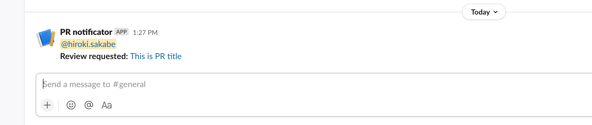
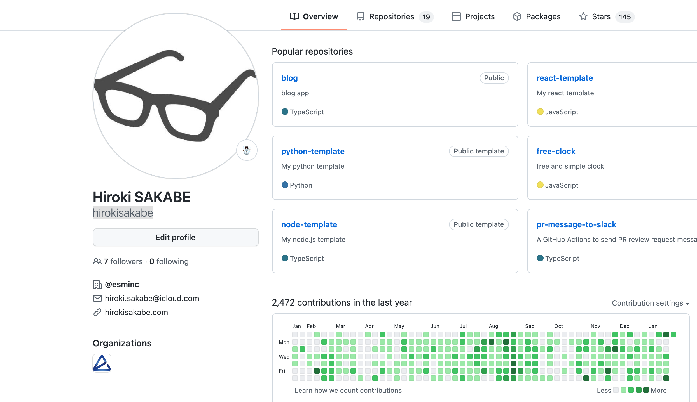
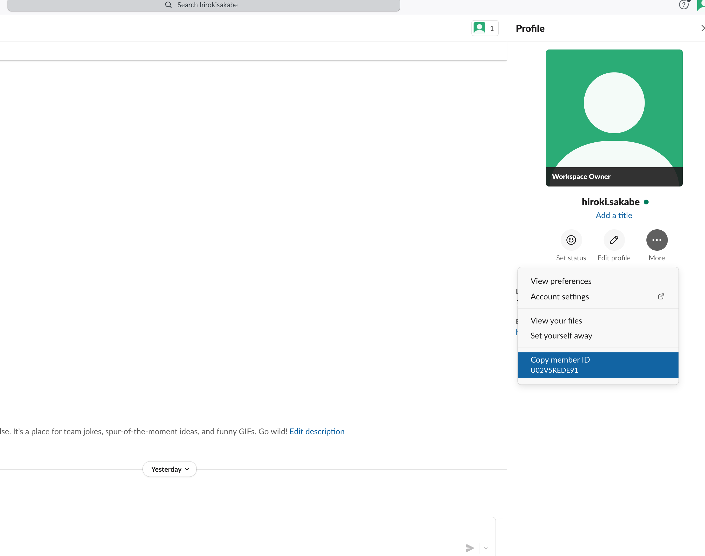

# pr-message-to-slack

A GitHub Action to send PR review request message to Slack.



(There are several Actions in the [Marketplace](https://github.com/marketplace?type=actions&query=pull+request+slack+) that are similar to this Action.)

## Usage

### 1. Create Your Slack App

See https://api.slack.com/apps

After creating, Activate Incoming Webhooks and generate Webhook URL. Then copy it.

### 2. Set the URL of the generated webhook as `PR_MESSAGE_SLACK_WEBHOOK_URL` in GitHub Repo Actions Secrets.

### 3. Commit GitHub Actions YAML and slack-id.json

**GitHub Actions YAML (e.g. `.github/workflows/slack-message.yml`)**

```yml
on:
  pull_request:
    # 'types' only supports 'review_requested'
    types: [review_requested]

# Prevent sending multiple messages when there are multiple reviewers.
concurrency:
  group: ${{ github.head_ref || github.run_id }}
  cancel-in-progress: true

jobs:
  pr-message-to-slack:
    runs-on: ubuntu-latest
    steps:
      # To use slack-id.json
      - uses: actions/checkout@v2
      - uses: hirokisakabe/pr-message-to-slack@v1.0.0
        env:
          # https://hooks.slack.com/...
          PR_MESSAGE_SLACK_WEBHOOK_URL: ${{ secrets.PR_MESSAGE_SLACK_WEBHOOK_URL }}
```

**`.github/slack-id.json`**

This action use `slack-id.json` to add a mention in Slack.

```json
{
  "UserA's GitHub username": "UserA's Slack member ID",
  "UserB's GitHub username": "UserB's Slack member ID"
}
```

You can find your GitHub username here.



You can find your Slack member ID here.



## License

MIT

## Author

Hiroki SAKABE
